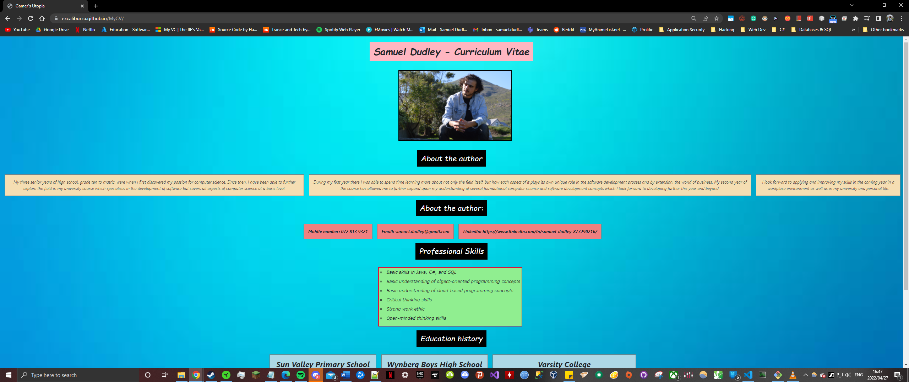

# MyCV
This application is a digital copy of my, Samuel Dudley's, personal CV. It aims to serve as a more visually attractive version of a conventional CV and is not interactable.

## Table of Contents
*Name and descrption - Page 1*

*Installation guide - Page 2*

*Appliction usage guide - Page 3*

*Credits - Page 4*

## Installation guide
To install the application simply download the files or clone the repository from Github (if access has been allowed). Once the files have been downloaded simply
run index.html from the application folder to launch the program. 

## Application usage guide
As this is a static web page it contains no interactable elements and as such interactibility with the page is limited to scrolling up and down to view different page sections.

## Credits
Author: Samuel Dudley - https://github.com/ExcaliburZA
Samuel Dudley is the soul author and publisher of this software and is solely responsible for its maintenance and support.

